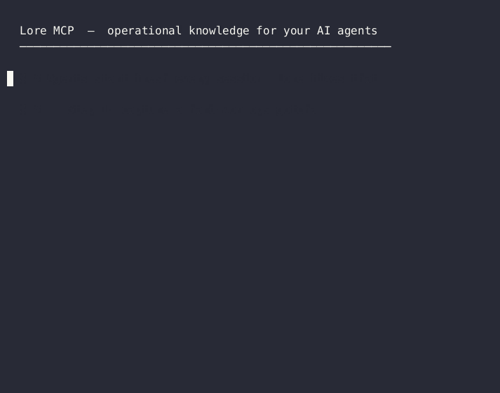

# lore-knowledge-mcp

**Operational knowledge layer for engineering teams and their AI agents.**

[](https://github.com/davidgut1982/lore-mcp)
[](https://github.com/davidgut1982/lore-mcp/actions/workflows/ci.yml)
[](https://python.org)
[](https://modelcontextprotocol.io)
[](LICENSE)

---



---

## The Problem

Your agents start every session knowing nothing about your systems. Every runbook you've written. Every gotcha you've hit. Every incident you've debugged. None of it carries forward.

You re-explain. They re-discover. Context vanishes when the session ends.

**Lore fixes that.**

```
Without Lore                     With Lore
─────────────────────────────    ──────────────────────────────────
Agent starts fresh every time    Agent queries Lore on startup
"How does our infra work?"       Gets: topology, gotchas, runbooks,
You re-explain everything        past incidents, verified decisions
Context lost at session end      Knowledge persists across all sessions
```

---

## How It's Different

| Tool | Built for | What it remembers | Agent-native |
|---|---|---|---|
| OB1 / personal memory | One person | Your thoughts and captures | No |
| Mem0 / Zep | App developers | User preferences, conversations | Partially |
| Confluence / Notion | Human teams | Documentation (human-browsed) | No |
| **lore-knowledge-mcp** | **Engineering teams + AI agents** | **How your systems actually work** | **Yes** |

Lore is not a second brain. It's the operational intelligence your agents need to work in *your* environment — not just any environment.

---

## What Lore Does

### Knowledge Base

Your team's operational knowledge — always queryable by any agent. Capture the things that matter: runbooks, hard-won gotchas, architecture decisions, deployment state. Every entry carries attribution so agents know who wrote it and whether a human has verified it.

### Investigations

When something breaks, open a structured investigation. Document the symptom, test hypotheses, record what you tried and what you found. Six months later when the same issue resurfaces — different engineer, different agent — the trail is there.

### Journal

A permanent record of milestones, architecture decisions, and buying decisions. The kind of thing that lives in someone's head until they leave the team.

---

## Built for Multi-Agent Systems

In a multi-agent environment, provenance matters. Every Lore entry carries `author`, `source_type`, and `verified`.

```
kb_search("proxmox lxc dns")

  [1] "LXC inherits host resolv.conf — Tailscale breaks containers"
      david · human · ✓ verified

  [2] "LXC DNS fix after Tailscale install"
      engineer-agent · agent · unreviewed

  [3] "LXC DNS configuration reference"
      research-agent · agent · ✗ disputed
```

Your agents know: result 1 is production-safe. Result 2, spot-check before acting. Result 3, review first.

---

## Quick Start

### Solo (SQLite — zero config, no server needed)

```bash
pip install lore-knowledge-mcp
export DB_BACKEND=sqlite KNOWLEDGE_DATA_DIR=~/.lore
lore-mcp
```

Add to Claude Code:

```json
{
  "mcpServers": {
    "lore": {
      "command": "lore-mcp",
      "env": {
        "DB_BACKEND": "sqlite",
        "KNOWLEDGE_DATA_DIR": "/home/yourname/.lore"
      }
    }
  }
}
```

### Team (PostgreSQL — shared knowledge layer)

```bash
pip install lore-knowledge-mcp
export DB_BACKEND=local DB_HOST=localhost DB_PORT=5432 \
       DB_NAME=lore DB_USER=lore_user DB_PASSWORD=yourpassword
lore-mcp --host 0.0.0.0 --port 5555
```

All agents on your team point at `http://your-server:5555/mcp`. One shared knowledge layer.

---

## Tool Reference

### Knowledge Base
| Tool | What it does |
|---|---|
| `kb_add` | Add an entry. Accepts `author`, `source_type` for attribution. |
| `kb_search` | Semantic search with optional topic filter. |
| `kb_get` | Fetch full entry by ID. |
| `kb_list` | List entries, filter by topic. |
| `kb_update` | Update content, tags, or set `verified` flag. |
| `kb_delete` | Delete entry (requires `confirm=true`). |

### Investigations
| Tool | What it does |
|---|---|
| `investigation_add` | Open or add to an investigation. |
| `investigation_list` | List investigations, filter by topic. |
| `investigation_get` | Fetch full investigation by ID. |
| `investigation_log_experiment` | Log a structured hypothesis → result → conclusion. |
| `investigation_list_experiments` | List all logged experiments. |

### Journal
| Tool | What it does |
|---|---|
| `journal_append` | Add a milestone, decision, or reflection. |
| `journal_list` | List recent entries (default 20). |
| `journal_get` | Fetch entry by ID. |
| `snapshot_config` | Snapshot a config object to the journal. |

### Document Ingestion
| Tool | What it does |
|---|---|
| `kb_ingest_doc` | Ingest a markdown file into the KB. |
| `kb_ingest_dir` | Batch-ingest a directory, with change detection. |
| `kb_sync_status` | Check what's changed since last sync. |

### MCP Index
| Tool | What it does |
|---|---|
| `mcp_index_scan` | Scan all configured MCP servers and index their tools. |
| `mcp_index_search` | Search indexed tools by description. |
| `mcp_index_get_server` | Get all tools for a specific MCP server. |
| `mcp_index_rebuild` | Force a full rescan. |

---

## Backends

| Backend | Use case | Setup |
|---|---|---|
| SQLite | Solo / local / single machine | No server, one env var |
| PostgreSQL | Team / shared / production | Self-hosted DB |
| Supabase | Cloud PostgreSQL | Managed, zero-ops |

---

## License

MIT — see [LICENSE](LICENSE)
