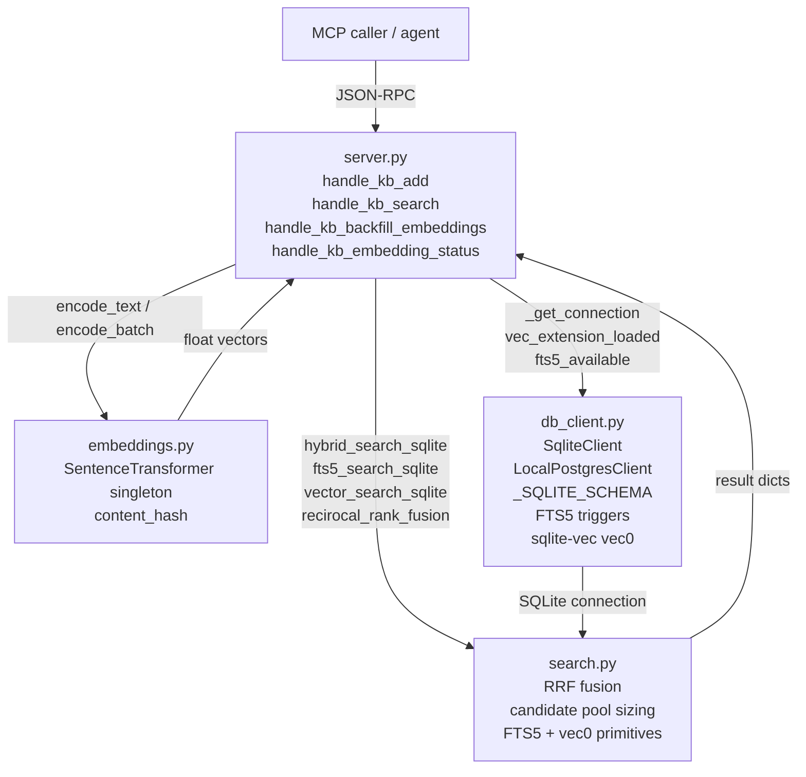

# Lore Semantic Search — Architecture

## Overview

Lore's semantic search subsystem (v0.6.0+) augments keyword retrieval with local vector embeddings so agents can find knowledge-base entries by meaning, not just lexical overlap. When `LORE_SEMANTIC_SEARCH=true`, every write to `kb_add` embeds the title + content with a local `sentence-transformers` model and stores the 384-dimensional vector in a `sqlite-vec` virtual table. At query time, `kb_search` runs an FTS5 BM25 pass and a cosine k-NN pass concurrently, then combines the ranked result lists with Reciprocal Rank Fusion (RRF). The entire subsystem is opt-in, self-hosted (no API keys), and degrades gracefully to lexical-only search when any component is unavailable.

---

## Module Layout



**Dependency direction:** `server.py` orchestrates all three modules. `search.py` only imports from `db_client.py` indirectly (receives a client object) and calls `embeddings.py` via a passed-in callable. `embeddings.py` has no imports from the other lore modules — it loads `sentence-transformers` lazily and is safe to import without the `[semantic]` extra installed.

---

## Data Flow — `kb_search` Read Path

Numbers correspond to rough line ranges in the v0.6.0 source.

```
Agent call: kb_search(query="DNS broken in containers", search_mode="hybrid")
    │
    ▼
server.py: handle_kb_search()                      [line ~1009]
    │
    ├─ 1. Resolve requested_mode: "hybrid"
    │
    ├─ 2. Gate check:
    │      is_sqlite = (DB_BACKEND == "sqlite")
    │      sqlite_vectors_ok = (
    │          is_sqlite
    │          AND semantic_enabled()          # search.py: LORE_SEMANTIC_SEARCH=true
    │          AND db.vec_extension_loaded     # db_client.py: sqlite-vec loaded
    │      )
    │
    ├─ 3. Load embedder (lazy, once):
    │      from lore.embeddings import encode_text, get_model_name
    │
    ├─ 4. Fallback check: if hybrid AND NOT fts5_available → effective_mode = "semantic"
    │
    ├─ 5. Delegate to search.hybrid_search_sqlite(db, query, …)
    │
    ▼
search.py: hybrid_search_sqlite()                 [line ~202]
    │
    ├─ 6. corpus_size = SELECT COUNT(*) FROM knowledge_kb_entries
    │      pool = candidate_pool_size(top_k, corpus_size)
    │      → min(corpus_size, 200, max(top_k*5, 50))
    │
    ├─ 7. FTS5 pass (if mode in {fts, hybrid}):
    │      fts5_search_sqlite(db, query, topic, pool)
    │      → SELECT … FROM knowledge_kb_entries_fts MATCH ?
    │        JOIN knowledge_kb_entries … ORDER BY bm25() LIMIT pool
    │
    ├─ 8. Vector pass (if mode in {semantic, hybrid}):
    │      query_vec = encode_query(query)          # calls embeddings.encode_text()
    │      vector_search_sqlite(db, query_vec, topic, pool)
    │      → serialize_float32(query_vec) → blob
    │        SELECT … FROM knowledge_kb_vec_embeddings WHERE embedding MATCH ? AND k = ?
    │        JOIN knowledge_kb_entries … ORDER BY distance
    │
    └─ 9. RRF fusion (hybrid only):
           fts_ids  = [row["kb_id"] for row in fts_rows]
           vec_ids  = [row["kb_id"] for row in vec_rows]
           fused    = reciprocal_rank_fusion([fts_ids, vec_ids], k=LORE_RRF_K)
           → scored, merged, de-duped result list
           top_k results returned with rrf_score attached
    │
    ▼
server.py: build ResponseEnvelope.success(…)      [line ~1082]
    response includes: results, count, search_mode, model, rrf_k
```

For **FTS-only** mode (`search_mode="fts"`, semantic off, or `fts5_available=True`), the vector pass and RRF are skipped entirely. The FTS5 fast path is at `server.py` line ~1100.

For the **legacy lexical path** (semantic disabled or SQLite LIKE fallback), `server.py` falls through to `SqliteTableQuery.or_()` with a `LIKE` pattern — this path predates v0.6.0 and is unchanged.

---

## Write Path — `kb_add` with `LORE_SEMANTIC_SEARCH=true`

```
Agent call: kb_add(topic, title, content, …)
    │
    ▼
server.py: handle_kb_add()                         [line ~960]
    │
    ├─ 1. Generate kb_id = "kb_" + uuid4().hex[:12]
    │
    ├─ 2. INSERT INTO knowledge_kb_entries (via SqliteTableQuery.insert())
    │      FTS5 AFTER INSERT trigger fires automatically:
    │        INSERT INTO knowledge_kb_entries_fts(rowid, title, content) VALUES(…)
    │
    ├─ 3. Gate: _semantic_write_enabled()           [line ~827]
    │      → DB_BACKEND == "sqlite"
    │        AND db.vec_extension_loaded
    │        AND LORE_SEMANTIC_SEARCH == "true"
    │
    └─ 4. If gate passes: _embed_kb_entry(kb_id, title, content)
               │
               ├─ a. content_hash = SHA-256(title + \x1f + content)
               ├─ b. encode_text(f"{title}\n\n{content}") → 384-d float list
               ├─ c. Dimension check: len(vector) == 384
               ├─ d. sqlite_vec.serialize_float32(vector) → blob
               ├─ e. DELETE FROM knowledge_kb_vec_embeddings WHERE kb_id = ?
               │      (vec0 doesn't support INSERT OR REPLACE)
               ├─ f. INSERT INTO knowledge_kb_vec_embeddings(kb_id, embedding)
               └─ g. INSERT OR REPLACE INTO knowledge_kb_embedding_meta
                      (kb_id, model_name, embedding_dim, content_hash, updated_at)

    Result: kb_add returns {ok: true, embedded: true/false}
    Embed failures are logged but do NOT fail the kb_add — backfill recovers.
```

**`kb_update`** re-embeds only when `title` or `content` changed. It computes `compute_content_hash(new_title, new_content)` and compares to `knowledge_kb_embedding_meta.content_hash`. If they match, `_embed_kb_entry` returns `(True, hash)` without re-encoding — see `server.py` line ~1281.

**`kb_delete`** deletes the `knowledge_kb_entries` row first (which cascades to `knowledge_kb_embedding_meta` via FK), then explicitly calls `_delete_kb_embedding(kb_id)` to remove the vec0 row (vec0 virtual tables don't support FK cascades).

---

## Backend Abstraction

Both `SqliteClient` and `LocalPostgresClient` expose two boolean attributes used by `server.py` and `search.py` to decide which path to take:

| Attribute | SQLite | PostgreSQL |
|---|---|---|
| `vec_extension_loaded` | `True` when sqlite-vec loads | `True` when pgvector detected + `kb_embeddings` table ready |
| `fts5_available` | `True` when FTS5 module compiled in | Not yet implemented (Phase 2) |

The `server.py` routing code checks `DB_BACKEND` and these flags without caring which client class is in use. The search module receives the client as a duck-typed `Any` and only calls `db._get_connection()` and tests the boolean attributes.

**SQLite path (v0.6.0, implemented):**
- Schema: `_SQLITE_SCHEMA` (`db_client.py` line ~681) creates `knowledge_kb_entries_fts` (FTS5 virtual table), `knowledge_kb_vec_embeddings` (vec0 virtual table, 384 floats), and `knowledge_kb_embedding_meta` (staleness tracking).
- `SqliteClient._try_load_vec_extension()` (`db_client.py` line ~1384) calls `conn.enable_load_extension(True)` then `sqlite_vec.load(conn)`. Silently no-ops if `sqlite_vec` isn't installed and semantic is off; logs an error if semantic is on.

**PostgreSQL path (v0.7.0, Phase 2 — in progress at time of writing):**
- Schema: `LocalPostgresClient._init_schema()` (`db_client.py` line ~118) creates `knowledge.kb_embeddings` with `halfvec(384)` (pgvector ≥ 0.7) or `vector(384)` (fallback) and an HNSW index. The schema is auto-applied on first connection.
- The Python write/read path (`_embed_kb_entry`, `vector_search_sqlite`) currently checks `DB_BACKEND == "sqlite"` and early-returns for PostgreSQL. This gate will be removed when Phase 2 is complete.
- `vec_extension_loaded` is set by `_init_schema()` if pgvector is found; `server.py` uses the same routing code once it is set.

**Design intent:** The `server.py` routing layer was written to be backend-agnostic. Once PostgreSQL write/read primitives are implemented, the `is_sqlite` gate in `handle_kb_search` and `_semantic_write_enabled` will be lifted.

---

## Failure Modes

### Model fails to load

`get_embedder()` raises `EmbeddingUnavailableError` in these cases:
- `LORE_SEMANTIC_SEARCH=false` — returned immediately without attempting to load.
- `sentence-transformers` not installed — ImportError caught and re-raised.
- Model download fails (no network, HuggingFace outage) — `SentenceTransformer()` raises; not caught in `get_embedder()`, propagates as a generic exception to the caller.
- ONNX backend unavailable — caught as `TypeError`/`ValueError`; retried with default backend (full PyTorch).

In all failure cases on the **read path**, `handle_kb_search` catches the unavailability in `_encode_query` (which returns `None` on `EmbeddingUnavailableError`) and degrades: hybrid mode drops to FTS-only, semantic mode returns an empty result. The response includes `degraded=True` and a human-readable `degraded_reason`.

On the **write path**, `_embed_kb_entry` is best-effort — failures log a warning and return `(False, content_hash)`. The `kb_add` call succeeds; the entry is recorded as `embedded=false` in the response. `kb_backfill_embeddings` can recover missed entries later.

### sqlite-vec extension missing

`SqliteClient._try_load_vec_extension()` tries `conn.enable_load_extension(True)` then `sqlite_vec.load(conn)`. If either raises:
- `LORE_SEMANTIC_SEARCH=false`: silently ignored (`logger.debug`).
- `LORE_SEMANTIC_SEARCH=true`: logs an error and leaves `vec_extension_loaded=False`.

Both FTS5 virtual table creation and vec0 creation are inside the same `executescript()` call. If vec0 fails (sqlite-vec missing) but `LORE_SEMANTIC_SEARCH=false`, the server falls back to `_CORE_SQLITE_STATEMENTS` (plain tables only) and boots normally.

### encode fails mid-request

In `hybrid_search_sqlite`, the `encode_query` callable wraps `encode_text` in a try/except. A failure mid-request (e.g. OOM, corrupt ONNX model) is caught, logged as a warning, and `query_vec` is set to `None`. The vector pass is skipped; the FTS pass still runs. Hybrid mode degrades to FTS-only for that request.

### content_hash drift

If the embedding model is changed (`LORE_EMBEDDING_MODEL` updated) after entries were embedded, `kb_backfill_embeddings` will detect the mismatch: it compares `meta_model` (stored in `knowledge_kb_embedding_meta`) against the current `_model_name()`. Any row where the model name differs is added to the backfill queue. Running `kb_backfill_embeddings` after a model change re-embeds all rows with the new model. Until backfill completes, existing entries return stale vectors; search degrades in accuracy but does not error.

### Model dimension mismatch

If a custom model outputs a vector whose `len()` is not 384, `_embed_kb_entry` logs an error and returns `(False, content_hash)` — no vec0 row is written. The mismatch is not fatal to the server, but the entry will never be found by vector search. The correct fix is to use a 384-d model or to change `EMBEDDING_DIM` and recreate the vec0 table (requires backfill).
